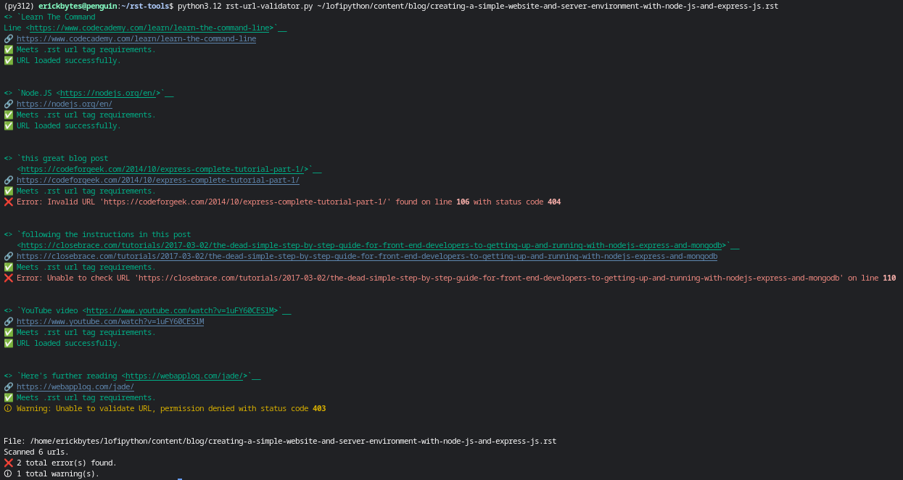

# rst-url-validator
A Python script for validating reStructuredText Format URLs

**Install Python Dependencies**

```
pip install requests
pip install rich
```

**Run the RST URL Validator CLI**
```
python rst-url-validator.py your_file.rst
```




**Pass --debug to Run in HTTP Debug Mode**
```
python rst-url-validator.py your_file.rst --debug
```
Passing --debug will print the HTTP request information associated with a url.

**External .rst Links**

The rst-url-validator.py script expects links to be in this format, with a single or double underscore at the end:

```
`free online courses on Coursera <https://www.coursera.org/learn/python>`__ 
```
Read more about this code in my [rst-url-validator Blog Post](https://lofipython.com/validating-rst-links-with-rst-url-validator).

